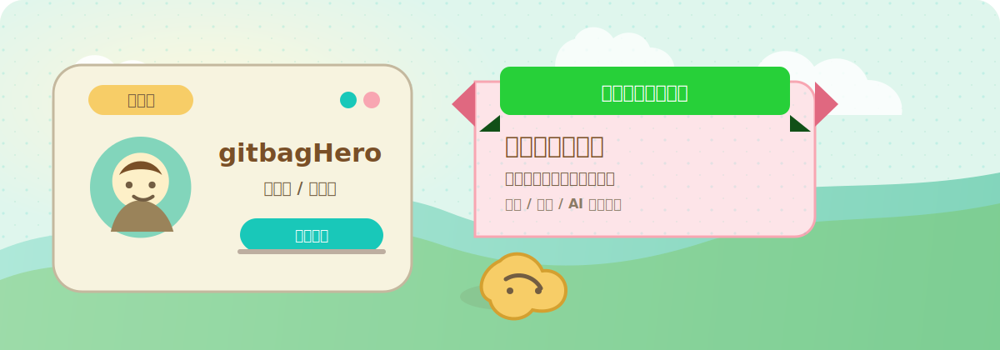
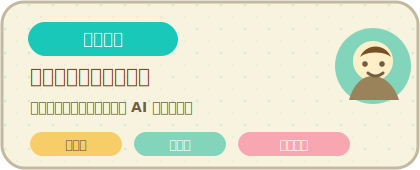
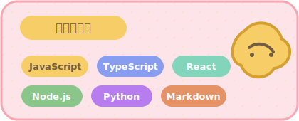

<p align="center">
  
</p>

<h1 align="center">你好，我是 gitbagHero</h1>

<p align="center">
  <b>欢迎来到我的代码小岛。</b><br />
  我喜欢把有趣的想法做成可用的界面、工具和清晰易维护的系统。
</p>

<p align="center">
  <a href="https://github.com/gitbagHero?tab=repositories">
    
  </a>
  <a href="https://github.com/gitbagHero">
    
  </a>
  
</p>

---

### 岛民档案

<table>
  <tr>
    <td width="50%" valign="top">
      <h3>正在关注</h3>
      <ul>
        <li>打磨小而完整的产品体验。</li>
        <li>探索 AI 辅助开发与个人效率工具。</li>
        <li>把 UI 想法转成清晰、可维护的代码。</li>
      </ul>
    </td>
    <td width="50%" valign="top">
      <h3>做事方式</h3>
      <ul>
        <li>先解决真实问题，再追求形式感。</li>
        <li>偏爱易读代码，而不是炫技代码。</li>
        <li>界面应该安静、清楚、好用。</li>
      </ul>
    </td>
  </tr>
</table>

### 岛上工具箱

<p>
  
  
  
  
  
  
  
</p>

### 公告板

```text
今日计划
  -> 做出一个真正有用的小东西
  -> 保持界面干净、有秩序
  -> 写下未来的自己也能看懂的代码

小岛规则
  细节不是装饰，细节决定用户如何感受产品。
```

### NookPhone 状态

<p align="center">
  
  
</p>

### 小岛地图

<table>
  <tr>
    <td width="33%" valign="top">
      <h3>UI 小屋</h3>
      <p>前端实验、视觉系统和组件细节。</p>
    </td>
    <td width="33%" valign="top">
      <h3>工具仓库</h3>
      <p>脚本、工作流、自动化和开发者工具。</p>
    </td>
    <td width="33%" valign="top">
      <h3>研究码头</h3>
      <p>笔记、原型、数据分析和 AI 产品想法。</p>
    </td>
  </tr>
</table>

---

<p align="center">
  <b>感谢来访我的代码小岛。</b><br />
  <sub>这个 Profile README 参考动森风 UI：羊皮纸卡片、薄荷青点缀、暖棕色文字和圆润轻快的组件感。</sub>
</p>
